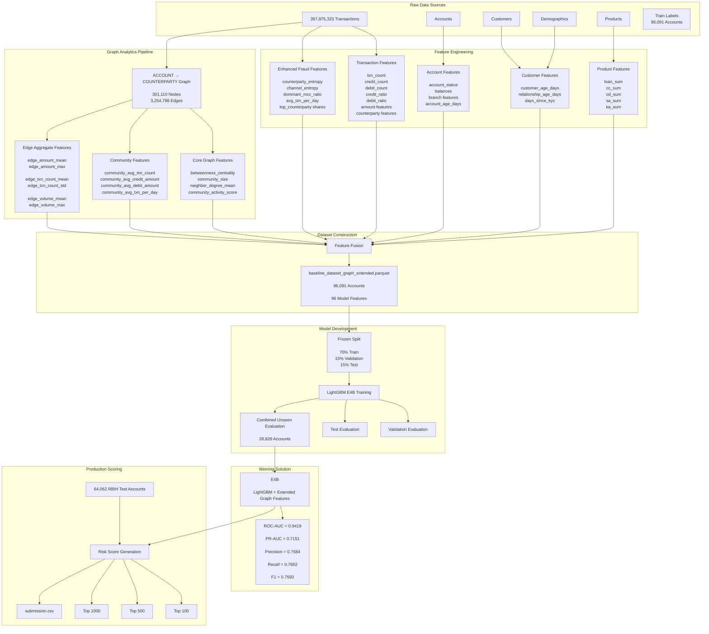

## Complete E4B End-to-End Architecture

```mermaid
flowchart TB

%% =====================================================
%% DATA SOURCES
%% =====================================================

subgraph DATA_SOURCES["Raw Data Sources"]

T["397,875,323 Transactions"]

A["Accounts"]

C["Customers"]

D["Demographics"]

P["Products"]

L["Train Labels<br/>96,091 Accounts"]

end

%% =====================================================
%% FEATURE ENGINEERING
%% =====================================================

subgraph FEATURE_ENGINEERING["Feature Engineering"]

TF["Transaction Features

txn_count
credit_count
debit_count
credit_ratio
debit_ratio
amount features
counterparty features"]

AF["Account Features

account_status
balances
branch features
account_age_days"]

CF["Customer Features

customer_age_days
relationship_age_days
days_since_kyc"]

PF["Product Features

loan_sum
cc_sum
od_sum
sa_sum
ka_sum"]

EF["Enhanced Fraud Features

counterparty_entropy
channel_entropy
dominant_mcc_ratio
avg_txn_per_day
top_counterparty shares"]

end

%% =====================================================
%% GRAPH PIPELINE
%% =====================================================

subgraph GRAPH_PIPELINE["Graph Analytics Pipeline"]

G1["ACCOUNT → COUNTERPARTY Graph

301,110 Nodes
3,254,788 Edges"]

G2["Core Graph Features

betweenness_centrality
community_size
neighbor_degree_mean
community_activity_score"]

G3["Community Features

community_avg_txn_count
community_avg_credit_amount
community_avg_debit_amount
community_avg_txn_per_day"]

G4["Edge Aggregate Features

edge_amount_mean
edge_amount_max

edge_txn_count_mean
edge_txn_count_std

edge_volume_mean
edge_volume_max"]

end

%% =====================================================
%% DATASET CREATION
%% =====================================================

subgraph DATASET_LAYER["Dataset Construction"]

FUSION["Feature Fusion"]

DATASET["baseline_dataset_graph_extended.parquet

96,091 Accounts

96 Model Features"]

end

%% =====================================================
%% MODEL TRAINING
%% =====================================================

subgraph MODEL_LAYER["Model Development"]

SPLIT["Frozen Split

70% Train
15% Validation
15% Test"]

TRAIN["LightGBM E4B Training"]

VALIDATE["Validation Evaluation"]

TEST["Test Evaluation"]

UNSEEN["Combined Unseen Evaluation

28,828 Accounts"]

end

%% =====================================================
%% FINAL MODEL
%% =====================================================

subgraph WINNING_MODEL["Winning Solution"]

E4B["E4B

LightGBM + Extended Graph Features"]

RESULTS["ROC-AUC = 0.9419

PR-AUC = 0.7151

Precision = 0.7584

Recall = 0.7602

F1 = 0.7593"]

end

%% =====================================================
%% PRODUCTION SCORING
%% =====================================================

subgraph PRODUCTION["Production Scoring"]

TESTSET["64,062 RBIH Test Accounts"]

SCORE["Risk Score Generation"]

TOP100["Top 100"]

TOP500["Top 500"]

TOP1000["Top 1000"]

SUBMISSION["submission.csv"]

end

%% =====================================================
%% FLOW
%% =====================================================

T --> TF

A --> AF

C --> CF

D --> CF

P --> PF

T --> EF

T --> G1

G1 --> G2
G1 --> G3
G1 --> G4

TF --> FUSION
AF --> FUSION
CF --> FUSION
PF --> FUSION
EF --> FUSION

G2 --> FUSION
G3 --> FUSION
G4 --> FUSION

FUSION --> DATASET

DATASET --> SPLIT

SPLIT --> TRAIN

TRAIN --> VALIDATE
TRAIN --> TEST
TRAIN --> UNSEEN

UNSEEN --> E4B

E4B --> RESULTS

E4B --> SCORE

TESTSET --> SCORE

SCORE --> TOP100
SCORE --> TOP500
SCORE --> TOP1000
SCORE --> SUBMISSION
```